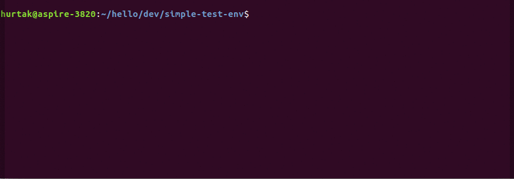
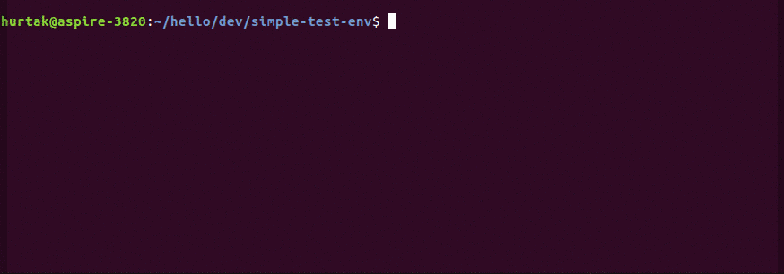

# Simple test env

- super simple shell script which quickly creates an environment with
    - desired os/language
    - shared folder
    - exposed port `8080` to host system
    - and it cleans up after itself, when you exit container is deleted, image is kept

## Demo

### Hello world from 3 operating systems under minute

### Test quickly multiple languages or language versions

### Run random scripts from the internet more safely

## Prerequisites

- [Docker](https://www.docker.com/) is required

### Operating system compatibility

- Works on Linux & MacOS
- Maybe works on Windows 10 (if somebody can confirm/deny, please create issue)

## Install

- with git `git clone https://github.com/hurtak/simple-test-env`
- or just download `start.sh` and make it executable with `chmod u+x start.sh`

## Usage

- `./start.sh <image> <command>`
    - image defaults to `debian`
    - command defaults to image's default command (usually `/bin/bash` with operating systems, or REPL with programming languages)
- workdir inside the image is set to `/usr/src/shared`
- in this directory, there will be automatically created `shared` directory, which will be mounted to the image's workdir

### Examples

- `./start.sh` run default image debian:8
- `./start.sh ubuntu:16.04` run image with ubuntu:16.04
- `./start.sh python:3` run image with python:3, uses image's default run command which starts python REPL
- `./start.sh python:3 /bin/bash` run image with python:3 and override run command to /bin/bash

### Shared port

- port `8080` is exposed to host system
- run something on `localhost:8080` in container, it will then be avaliable on `localhost:8080` on host system
